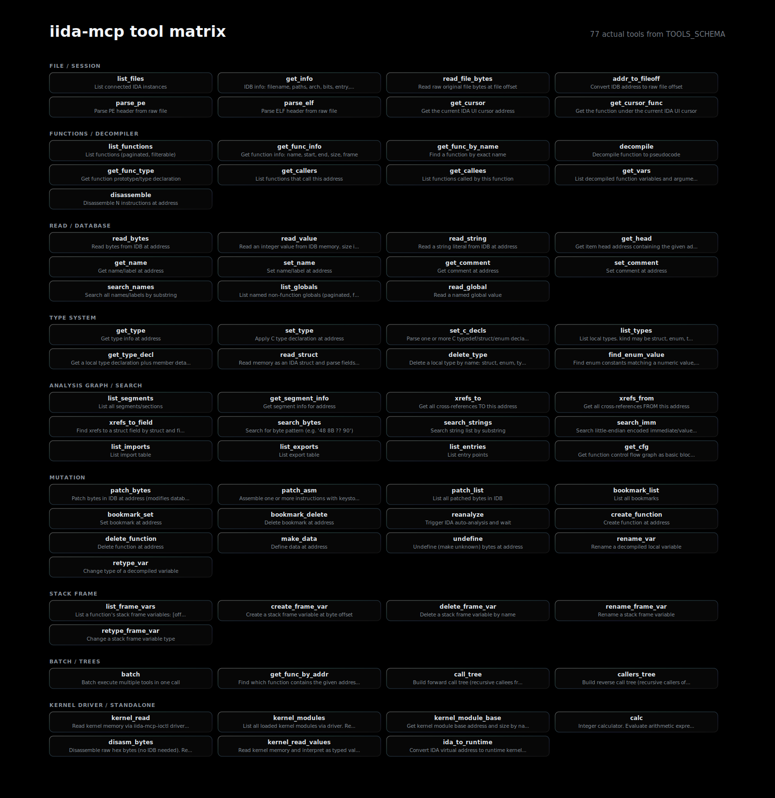

# iida-mcp

[Chinese](README.md) | [English](README_EN.md)



`iida-mcp` is an IDA Pro plugin that exposes the current IDB through a local HTTP MCP server.

This MCP is primarily designed for x86/x86-64 executables and the corresponding IDA capabilities. For other needs, please open an issue.

- 77 MCP tools
- Mainly compatible with IDA 8+, including IDA 9.x
- Multi-IDA instance routing
- Optional Windows kernel driver support
- Hotkey: `Alt+Shift+I`

## Overview

- File metadata, raw bytes, PE/ELF parsing
- Functions, disassembly, CFG, xrefs, call trees
- Hex-Rays pseudocode, arguments, local variables
- Structs, enums, local types, typed reads
- Name, string, byte-pattern, and immediate searches
- Renaming, comments, types, patches, bookmarks, batch operations
- Optional kernel memory reads, kernel module enumeration, and IDA-to-runtime address mapping

## Installation

Copy `iida.py` and `iida_core/` into IDA's `plugins/` directory:

```text
plugins/
  iida.py
  iida_core/
    __init__.py
    cache.py
    kdriver.py
    protocol.py
    registry.py
    router.py
    server.py
    thread_safe.py
    tools.py
    worker.py
```

## Usage

1. Open a target file in IDA.
2. Start the plugin from `Edit > Plugins > iida-mcp`, or press `Alt+Shift+I`.
3. The first active IDA instance listens on `0.0.0.0:13897`, so it can be reached through loopback or a host network-interface IP; later instances join as Workers.
4. Trigger the menu item or hotkey again to stop iida-mcp in the current IDA instance.
5. With one IDB, the `f` parameter can be omitted. With multiple IDBs, call `list_files` and pass the returned file id as `f`.

## MCP Client Configuration

Endpoint:

```text
http://127.0.0.1:13897/mcp
```

When connecting from another machine, replace `127.0.0.1` with the IDA host IP, for example:

```text
http://192.168.153.1:13897/mcp
```

For clients that support HTTP/Streamable HTTP MCP servers, add a remote MCP server and point it to the endpoint above.

Generic example:

```json
{
  "mcpServers": {
    "iida": {
      "url": "http://127.0.0.1:13897/mcp"
    }
  }
}
```

Client-specific field names may vary. The required target is the local HTTP MCP endpoint above.

## Dependencies

The core plugin uses IDA's bundled IDAPython and the Python standard library.

- Decompiler tools require Hex-Rays Decompiler.
- `disasm_bytes` requires `capstone` in IDA's Python environment. If missing, it returns `capstone not installed (pip install capstone)`.
- Kernel tools require the `iida-mcp-ioctl` driver.

## Kernel Driver

The `driver/` directory contains the `iida-mcp-ioctl` Windows kernel driver source. It provides:

- Kernel memory reads
- Kernel module listing
- Module base lookup by name

Building requires Visual Studio Build Tools and WDK. `driver/build.bat` uses the `MSVC`, `WDK`, and `SDK_VER` environment variables when set, otherwise it tries to detect standard installation paths.

A prebuilt `iida-mcp-ioctl.sys` is included under `driver/`. Loading it requires appropriate signing and system policy configuration. If the driver is not loaded, kernel tools return a clear error.

## Ports

| Port | Purpose |
|------|---------|
| `13897` | MCP HTTP server, listens on all network interfaces |
| `13898` | Internal Worker communication, loopback only |
